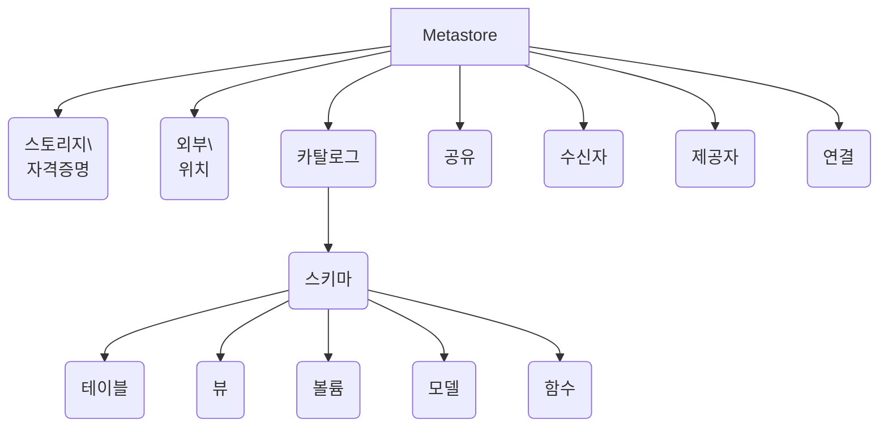

```mermaid
    flowchart TD
        Metastore --> strCred(스토리지\\n자격증명)
        Metastore --> extLoc(외부\\n위치)
        Metastore --> Catalog(카탈로그)
        Metastore --> Share(공유)
        Metastore --> Recipient(수신자)
        Metastore --> Provider(제공자)
        Metastore --> Connection(연결)
        Catalog --> Schema(스키마)
        Schema --> Table(테이블)
        Schema --> View(뷰)
        Schema --> Volume(볼륨)
        Schema --> Model(모델)
        Schema --> Functions(함수)
```